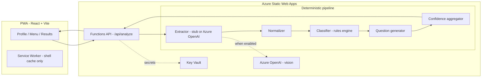

# Food Signal

AI-powered dining safety assistant. Food Signal takes a user's dietary profile
(diet restriction, diet preference, allergies) and a restaurant menu (image, PDF,
or pasted text), then returns dishes grouped as **Safe / Caution / Avoid** with
reasons, confidence, and practical questions to ask restaurant staff.

> **Disclaimer:** Food Signal provides informational guidance only. It never
> guarantees a dish is safe. Always verify ingredients and preparation with
> restaurant staff.

This repository is an **MVP scaffold**. It runs fully offline out of the box
(no Azure required) using a deterministic stub extractor, and is ready to switch
to Azure OpenAI by replacing dummy configuration values.

---

## 1. Architecture summary



**Key design decision:** the LLM only does OCR + extraction. The final
Safe/Caution/Avoid decision is made by **deterministic, unit-tested code**
(`api/src/services/classificationService.ts` + `api/src/rules/*.json`). This
keeps allergy-critical logic predictable and testable without the model.

## 2. Folder structure

```
.
├── frontend/                # React + Vite PWA (Screens 1-3)
│   ├── public/              # manifest.webmanifest, icons, favicon
│   └── src/
│       ├── api/             # Typed API client
│       ├── components/      # DishCard, badges, shared questions
│       ├── config/          # Browser-safe runtime config
│       ├── pages/           # ProfilePage, MenuPage, ResultsPage
│       ├── state/           # Session context (memory + sessionStorage)
│       ├── utils/           # File reader (base64 + limits)
│       └── validation/      # Client-side profile validation
├── api/                     # Azure Functions (Node/TS) - trusted boundary
│   └── src/
│       ├── functions/       # analyze.ts (POST /api/analyze), health.ts
│       ├── services/        # extractor(s), normalizer, classifier, questions, confidence, orchestrator
│       ├── rules/           # aliasMap.json, rules.json, dishOntology.json (data-driven)
│       ├── validation/      # Zod schemas (request + LLM output)
│       ├── config/          # Strongly-typed config + Key Vault resolver
│       ├── errors/          # AppError + error handler
│       ├── logging/ di/ prompts/
│       └── tests/           # unit + integration (offline)
├── shared/                  # @food-signal/shared - domain + API contracts
├── infra/                   # Bicep placeholders (dummy values)
├── .github/workflows/       # CI + Static Web Apps deploy (placeholder)
└── staticwebapp.config.json # Routing, CSP, security headers
```

## 3. Technology stack (why)

| Layer | Choice | Rationale |
| --- | --- | --- |
| Frontend | React + Vite + TypeScript | Fast PWA dev, strong ecosystem, typed contracts |
| PWA | `vite-plugin-pwa` (Workbox) | Installable, caches shell only (no profile/menu data) |
| Backend | Azure Functions (Node/TS) | Serverless, integrated with Static Web Apps |
| Contracts | `@food-signal/shared` workspace | One source of truth for request/response types |
| Validation | Zod | Runtime validation at the boundary + LLM output repair |
| Rules | Plain TS + JSON | Deterministic, testable without the LLM (safety core) |
| AI | Azure OpenAI (vision) | Menu image understanding + structured output |
| Secrets | Key Vault + Managed Identity | No secrets in the browser bundle or code |
| Tests | Vitest | Unified test runner across all workspaces |
| IaC | Bicep | Reproducible Azure provisioning |

TypeScript end-to-end keeps the `AnalyzeRequest` / `AnalyzeResponse` contract
consistent across the PWA and the API.

## 4. Domain models & API contracts

All in `shared/src/`:

- `domain.ts` - `UserProfile`, `Ingredient`, `ExtractedDish`, `AnalyzedDish`,
  `Classification`, `ConfidenceLevel`, `OverallConfidence`, ...
- `contracts.ts` - `AnalyzeRequest`, `AnalyzeResponse`, `ApiErrorResponse`,
  `DISCLAIMER`.
- `config.ts` - dropdown options + upload limits (configuration-driven).

`POST /api/analyze` request/response shapes match Section 9 of the MVP
requirements document.

## 5. Running locally

### Prerequisites
- Node.js 18+ and npm
- (Optional) [Azure Functions Core Tools](https://learn.microsoft.com/azure/azure-functions/functions-run-local) to run the API host
- (Optional) [Static Web Apps CLI](https://azure.github.io/static-web-apps-cli/) to run both together

### Install & build
```powershell
npm install
npm run build:shared   # build shared contracts first
```

### Option A - run frontend + API separately
```powershell
# Terminal 1: API (Functions host on :7071). Copy settings first:
Copy-Item api/local.settings.json.example api/local.settings.json
npm run start --workspace api

# Terminal 2: PWA (Vite dev server on :5173, proxies /api -> :7071)
Copy-Item frontend/.env.example frontend/.env
npm run dev --workspace frontend
```
Open http://localhost:5173.

### Option B - run everything with the SWA CLI
```powershell
npm run start:swa
```

> The scaffold defaults to `USE_STUB_EXTRACTOR=true`, so it works **without any
> Azure resources**. On the Menu screen, click **Try a sample menu** for an
> instant end-to-end demo.

### Test
```powershell
npm test                      # all workspaces
npm run test --workspace api  # backend unit + integration
```

## 6. Switching from stub to real Azure OpenAI

1. Provision resources (see `infra/` and `Documents/Food-Signal-Azure-Setup-Guide.md`).
2. In `api/local.settings.json` (local) or Static Web App settings (cloud):
   - set `USE_STUB_EXTRACTOR=false`
   - set `AZURE_OPENAI_ENDPOINT`, `AZURE_OPENAI_DEPLOYMENT`, `AZURE_OPENAI_API_VERSION`
   - in production, resolve `AZURE_OPENAI_KEY` from Key Vault via managed identity
     (`api/src/config/keyVaultSecrets.ts`) rather than app settings.

All Azure values in this repo are **dummy placeholders** marked with
`TODO: Replace with actual Azure resource during deployment.` and are isolated in
config files — never hardcoded in application logic.

## 7. Error handling & logging

- **Errors:** `AppError` (`api/src/errors/appError.ts`) carries a typed
  `ApiErrorCode` + HTTP status; `errorHandler.ts` converts any failure into a
  safe `ApiErrorResponse` (no stack traces or PII leaked). One retry on
  transient model/extraction failures (NFR 5.2).
- **Logging:** the `Logger` abstraction never receives raw allergy/menu content
  (Privacy 5.3) — ids and counts only.

## 8. Testing strategy

- **Unit (api):** deterministic classifier + normalizer — the safety core,
  tested without the LLM.
- **Integration (api):** the full orchestrator via the offline stub extractor.
- **Unit (frontend):** profile validation + a Profile screen component test.
- CI runs everything offline with `USE_STUB_EXTRACTOR=true`.

## 9. MVP scope note

This scaffold implements the MVP (three-screen flow, deterministic risk engine,
questions, PWA shell). Explicitly **out of scope** here and left as documented
extension points: durable persistence (Cosmos DB), Azure AI Search retrieval,
Document Intelligence OCR, and chronic-condition rules (the `conditions` field
exists in the model but is not collected by the MVP UI).

## 10. Documents

Source-of-truth documents live in `docs/`:
`Food-Signal-PRD.md`, `Food-Signal-MVP-Requirements-and-PWA-Design.md`,
`Food-Signal-Technical-Details.md`, `Food-Signal-Azure-Setup-Guide.md`.
