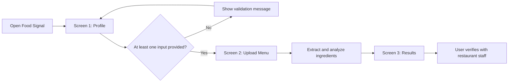

# Food Signal MVP Requirements and PWA Design

## 1. Document Purpose

This document defines the MVP for Food Signal based on the proposed three-screen user flow:

1. User profile input: Diet Restriction, Diet, and Allergies.
2. Menu upload and ingredient analysis.
3. Personalized results with Safe, Caution, Avoid, and questions to ask restaurant staff.

This document complements:

- `Food-Signal-PRD.md`
- `Food-Signal-Architecture.md`
- `Hackathon'26 Idea.docx`

The linked SharePoint requirements document requires sign-in in the current environment. Its exact output fields should be reconciled with Section 7 after the document is made available locally.

## 2. MVP Definition

Food Signal is a Progressive Web App that helps a user assess restaurant menu dishes against at least one personal food constraint. The user does not need to create an account for the MVP.

The MVP accepts one or more of the following profile inputs, but requires at least one:

- Diet restriction: a restriction such as vegetarian, vegan, halal, kosher, gluten-free, or lactose-free.
- Diet: a dietary objective or preference such as low sodium, low sugar, low fat, high protein, or spicy-food avoidance.
- Allergies: free-text allergies such as peanut, tree nut, shellfish, dairy, egg, soy, wheat, sesame, or fish.

The MVP then analyzes a menu upload or menu text, identifies dishes and likely ingredients, compares them with the profile, and returns actionable guidance.

## 3. MVP User Flow



### Screen 1: User Profile

The screen contains three controls:

- Diet restriction dropdown.
- Diet dropdown.
- Allergies text input.

The user can provide one, two, or all three inputs. The Continue action is enabled only when at least one field contains a meaningful value.

Validation examples:

- Diet restriction selected: valid.
- Diet selected: valid.
- Allergies contains `peanuts`: valid.
- Allergies contains only spaces: invalid.
- No value in any field: show `Please provide at least one dietary restriction, diet preference, or allergy.`

### Screen 2: Menu Upload

The screen allows the user to provide menu content using the MVP-supported path:

- Upload an image of a menu.
- Upload a PDF if supported by the selected implementation.
- Paste menu text as a fallback.

The user can select `Analyze menu` after a valid input is present. The UI should show progress stages such as:

1. Reading menu.
2. Finding dishes.
3. Identifying ingredients.
4. Comparing with your profile.
5. Preparing questions to ask the restaurant.

### Screen 3: Results

The results screen displays:

- Safe dishes.
- Caution dishes.
- Avoid dishes.
- Reasons for each classification.
- Confidence or uncertainty.
- Questions to ask restaurant staff.
- A visible informational disclaimer.

The app must never describe a dish as guaranteed safe. `Safe` means no obvious conflict was found from the available menu information.

## 4. Functional Requirements

### 4.1 Profile Input

| ID | Requirement | Priority |
| --- | --- | --- |
| FR-001 | The app shall display Diet Restriction, Diet, and Allergies inputs. | Must |
| FR-002 | Diet Restriction shall be a dropdown with configurable options. | Must |
| FR-003 | Diet shall be a dropdown with configurable options. | Must |
| FR-004 | Allergies shall accept free text and allow multiple comma-separated values. | Must |
| FR-005 | The app shall allow the user to proceed when at least one of the three inputs is provided. | Must |
| FR-006 | The app shall block progression when all three inputs are empty. | Must |
| FR-007 | The app shall preserve profile values while the user moves through the flow. | Must |
| FR-008 | The app should normalize common aliases such as `nuts`, `tree nuts`, `peanut`, and `peanuts`. | Should |
| FR-009 | The app should allow the user to edit profile values before submitting analysis. | Should |

Recommended initial dropdown options:

**Diet restriction**

- Vegetarian
- Vegan
- Halal
- Kosher
- Gluten-free
- Lactose-free
- None

**Diet**

- Low sodium
- Low sugar
- Low fat
- High protein
- Avoid spicy food
- No preference

These lists should remain configuration-driven so they can be changed without changing the analysis pipeline.

### 4.2 Menu Input

| ID | Requirement | Priority |
| --- | --- | --- |
| FR-010 | The app shall accept a menu image for analysis. | Must |
| FR-011 | The app should accept pasted menu text as a reliable fallback. | Must |
| FR-012 | The app may accept PDF menus if time permits. | Should |
| FR-013 | The app shall validate supported file types and maximum file size. | Must |
| FR-014 | The app shall show the selected file or pasted text before analysis. | Should |
| FR-015 | The app shall provide a retry or alternate input path when extraction fails. | Must |
| FR-016 | The app shall not permanently store uploaded menu files in the MVP. | Must |

Recommended hackathon limits:

- One menu file per analysis.
- Maximum image size: 10 MB.
- Maximum pasted text: 30,000 characters.
- Supported image types: PNG, JPEG, and WebP.
- Supported document type, if implemented: PDF.

### 4.3 Menu and Ingredient Analysis

| ID | Requirement | Priority |
| --- | --- | --- |
| FR-017 | The system shall extract dish names and menu descriptions. | Must |
| FR-018 | The system shall identify explicitly listed ingredients. | Must |
| FR-019 | The system shall identify likely ingredients implied by dish names, sauces, cooking methods, and regional terminology. | Must |
| FR-020 | The system shall distinguish stated ingredients from inferred ingredients. | Must |
| FR-021 | The system shall normalize ingredients before profile comparison. | Must |
| FR-022 | The system shall preserve uncertainty when an ingredient cannot be confirmed. | Must |
| FR-023 | The system shall identify possible cross-contact concerns such as shared oil or shared cooking surfaces when indicated. | Should |
| FR-024 | The system shall return structured output even when some dishes are ambiguous. | Must |

#### 4.3.1 Inferred Ingredient Validation (FR-020)

Inferred ingredients are never presented as facts. The system validates them with the human in two ways:

1. **Visible labeling in the UI.** Each ingredient is tagged with its source so the user can see what is confirmed versus assumed:
   - `Stated`: printed on the menu.
   - `Typical`: commonly present in this dish.
   - `Possible`: varies by restaurant or recipe.
   The results screen renders inferred ingredients under a heading such as `Likely, please confirm` instead of mixing them with stated ingredients.
2. **Turn the inference into a question.** Every inferred ingredient that affects the classification becomes a server question (see Section 4.5). The user validates the inference by asking the restaurant, not by trusting the app. Example: an inferred `cashew` in a korma becomes `Does the korma contain cashews or other nuts?`

This keeps the human in the loop: the app proposes, the restaurant confirms, and the user decides.

#### 4.3.2 Preserving Uncertainty (FR-022)

"Preserve uncertainty" means the system must never collapse an unknown into a false certainty. Concretely:

- Keep the `source` field (`stated`, `typical`, `possible`) on every ingredient rather than flattening to a single list.
- Attach a `confidence` value to each inferred ingredient (see FR-031).
- Use hedged language in reasons and questions: `may contain`, `often prepared with`, `ask whether`, never `contains` unless the menu states it.
- When a required detail is missing, raise the dish to `Caution` instead of guessing `Safe`.
- Record an `uncertainties` array on each dish listing exactly what could not be confirmed, which then drives the questions.

#### 4.3.3 Ambiguity Handling (FR-024)

Ambiguity is handled with a defined fallback ladder so the pipeline never crashes or silently drops a dish:

| Ambiguity type | Handling |
| --- | --- |
| Dish name unreadable from image | Keep the raw text, mark `lowExtractionConfidence`, ask the user to confirm or retype the dish. |
| Dish recognized but composition unknown | Return the dish with empty inferred ingredients, classify as `Caution`, and generate a general "what is in this dish" question. |
| Multiple plausible recipes (e.g., biryani with or without ghee) | Include the divergent ingredient as `possible`, classify as `Caution`, and ask a disambiguating question. |
| Partial menu (price and name only) | Proceed with typical-composition inference at reduced confidence and clearly label it. |

The rule of thumb: ambiguity always resolves toward `Caution` plus a question, never toward `Safe`.

#### 4.3.4 Handling Too Many Inferred Ingredients

A dish can produce a long list of inferred ingredients, especially for regional or compound dishes. Showing all of them would overwhelm the user and hide the important ones. The system reduces the list using relevance, not just volume.

1. **Filter to profile-relevant ingredients first.** Only ingredients that map to one of the user's allergies, restrictions, or diet concepts affect the classification and the displayed reasons. An inferred ingredient the user does not care about is kept in the data but not surfaced.
2. **Rank the relevant ones by severity, then confidence.** Allergy conflicts rank above restriction conflicts, which rank above preference concerns. Within a tier, higher-impact and higher-confidence items come first.
3. **Cap what is shown.** Display the top few drivers on the dish card (for example, the top three) with a `show all likely ingredients` expander for the rest.
4. **Collapse into a single concern when possible.** Multiple nut inferences (`cashew`, `pine nut`, `walnut`) become one concept-level concern (`tree nuts`) and one question, rather than three lines.
5. **Deduplicate across dishes.** A concern shared by many dishes becomes a single profile-level question (see Section 4.5.1) instead of repeating per dish.

The result: the user sees a short, prioritized set of what actually matters to them, while the full inferred list stays available on demand.

### 4.4 Risk Classification

| ID | Requirement | Priority |
| --- | --- | --- |
| FR-025 | The system shall classify each analyzed dish as Safe, Caution, or Avoid. | Must |
| FR-026 | The system shall classify an explicit allergy conflict as Avoid. | Must |
| FR-027 | The system shall classify an uncertain possible allergen or cross-contact concern as Caution. | Must |
| FR-028 | The system shall classify a clear diet restriction conflict as Avoid. | Must |
| FR-029 | The system shall classify a likely diet or condition conflict as Caution or Avoid according to configured rules. | Must |
| FR-030 | The system shall include one or more reasons for Caution and Avoid results. | Must |
| FR-031 | The system shall include a confidence value or uncertainty label. | Must |
| FR-032 | The system shall default to Caution when information is insufficient to establish safety. | Must |

Classification meaning:

- **Safe:** no obvious conflict was found based on the available menu information. This is not a guarantee.
- **Caution:** possible conflict, uncertain ingredient, cross-contact concern, or preference mismatch. Verify with restaurant staff.
- **Avoid:** clear conflict with an allergy or dietary restriction, or a strong configured conflict with the user's stated profile.

#### 4.4.1 Confidence Calculation (FR-031)

Confidence is not a probability from the model alone. It is a small deterministic score computed by the application from four signals, so the value is explainable and consistent.

| Signal | High weight | Low weight |
| --- | --- | --- |
| Ingredient source | `stated` on the menu | `possible` variant only |
| Menu detail level | full description with ingredients | name and price only |
| Regional variability | low-variation dish | high-variation regional dish |
| Extraction quality | clean text or clear image | low-quality OCR result |

Suggested scoring:

- Start each ingredient at a base score.
- `stated` adds the most; `typical` adds moderate; `possible` adds least.
- Rich menu descriptions increase the score; name-only menus decrease it.
- High regional variability decreases the score.
- Poor extraction decreases the score.

Map the total to a label the UI shows:

- `high`: confirmed or near-certain from the menu.
- `medium`: typical composition, reasonable but unconfirmed.
- `low`: possible-only or extracted from poor input.

The dish-level confidence is the lowest confidence among the ingredients that drove its classification, because the weakest safety-relevant fact should govern how cautious the message is. Model self-reported confidence may be used as a tie-breaker but never as the sole source.

#### 4.4.2 Aggregate Confidence Score

Beyond per-ingredient and per-dish confidence, the system produces one overall analysis confidence so the user gets a single, honest read on how much to trust the whole result.

Inputs to the aggregate score:

- **Extraction quality:** how cleanly the menu was read (clear image and text raise it; blurry or partial menus lower it).
- **Menu completeness:** share of dishes with real descriptions versus name-only entries.
- **Coverage:** share of dishes the system could classify with `stated` or `typical` ingredients rather than `possible`-only guesses.
- **Weakest-link dampening:** if any safety-critical dish (an allergy `Avoid`/`Caution`) rests on low confidence, the aggregate is pulled down.

Presentation:

- Show it as a single label such as `Overall confidence: Medium` with one line of context, for example `Based partly on typical recipes; confirm with staff.`
- Keep it advisory. The aggregate score never upgrades a dish to `Safe`; it only tells the user how firmly to rely on the analysis.
- The aggregate is the weighted combination of the signals above, capped by the lowest safety-critical dish confidence, so it can never look more confident than the riskiest important result.

### 4.5 Restaurant Questions

| ID | Requirement | Priority |
| --- | --- | --- |
| FR-033 | The system shall generate practical questions for Caution and Avoid dishes. | Must |
| FR-034 | Questions shall refer to the specific uncertain ingredient or preparation concern. | Must |
| FR-035 | Questions should be short enough to read aloud to a server. | Must |
| FR-036 | The user shall be able to copy questions. | Should |

Examples:

- Does the pesto contain pine nuts, walnuts, or other tree nuts?
- Is the broth made with shellfish stock?
- Is this fried in shared oil with wheat-battered or shellfish items?
- Can the sauce be prepared without dairy?

#### 4.5.1 Reducing User Effort

The questions feature must save time, not create a reading task. Design choices for the MVP:

- **Deduplicate across dishes.** If five dishes each raise the same `Does this contain nuts?` concern, show it once at the top as a profile-level question rather than repeating it per dish.
- **Rank by severity.** Show allergy questions first, then dietary-restriction questions, then preference questions.
- **Cap the list.** Show at most the top three to five questions by default, with a `show more` expander.
- **One-tap actions.** Provide `Copy all` and per-question copy so the user can paste into a note or read aloud immediately.
- **Group by dish only when needed.** Dish-specific questions attach to the dish card; shared questions live in a single "Ask your server" summary card.
- **Pre-phrase for speaking.** Questions are short, single-sentence, and ready to read to a server without editing.

The target is that a user can glance at one card, copy it, and ask two or three questions total, instead of managing a long per-dish checklist.

#### 4.5.2 Unanswered or Partially Answered Questions

The user often cannot get answers to every question, either because staff are unsure or the user does not ask. The system must degrade safely rather than assume the best case.

- **Default unresolved concerns to Caution.** Any dish with an unanswered safety-relevant question stays at `Caution` at best. An unanswered question never lets a dish become `Safe`.
- **Unanswered allergy questions hold at Avoid.** If a possible allergen drove a `Caution` and it cannot be confirmed safe, the guidance for an allergic user should hold at `Avoid`-level caution rather than relax. Absence of an answer is treated as unresolved risk, not as reassurance.
- **Make answering optional and non-blocking.** The MVP does not require the user to input answers to proceed. Questions are guidance to ask staff, not a form to complete.
- **Optional lightweight feedback loop (stretch).** If time allows, let the user tap a question as `Confirmed safe`, `Confirmed present`, or `Unknown`:
  - `Confirmed safe` may relax that specific concern.
  - `Confirmed present` escalates the dish toward `Avoid`.
  - `Unknown` or no input keeps the current cautious classification.
- **Always keep the disclaimer visible.** Regardless of answers, the results remain informational and direct the user to verify with restaurant staff.

The governing principle: unknown means caution. The system only relaxes a classification on an explicit positive confirmation, never on silence.

### 4.6 Results and Recovery

| ID | Requirement | Priority |
| --- | --- | --- |
| FR-037 | The results screen shall group dishes under Safe, Caution, and Avoid. | Must |
| FR-038 | The results screen shall show the dish name, reason, and confidence. | Must |
| FR-039 | The results screen shall show the user's active profile summary. | Should |
| FR-040 | The results screen shall show the informational disclaimer. | Must |
| FR-041 | The app shall show a meaningful error when analysis fails. | Must |
| FR-042 | The app shall offer pasted text or sample menu fallback when image extraction fails. | Must |
| FR-043 | The user shall be able to return to the profile or menu screen without losing the current session. | Should |

## 5. Non-Functional Requirements

### 5.1 Performance

| ID | Requirement | MVP Target |
| --- | --- | --- |
| NFR-001 | Profile screen interaction | Immediate, under 100 ms locally |
| NFR-002 | Initial PWA load on a normal broadband connection | Under 3 seconds after first install/cache |
| NFR-003 | Menu analysis response | Under 30 seconds for a small menu |
| NFR-004 | UI feedback during analysis | Visible within 1 second of submission |
| NFR-005 | Maximum concurrent demo analyses | At least 3 without crashing |

### 5.2 Reliability

- The app shall return a controlled error for AI timeout, invalid model output, unsupported files, and extraction failure.
- The app shall validate the AI response against a schema before rendering it.
- The app shall retry one transient AI or extraction failure, then show a recovery action.
- The app shall retain the user's current session state during an analysis failure.
- The demo shall have a known sample menu fallback.

### 5.3 Security and Privacy

- No account is required for the MVP.
- Profile data shall remain in browser memory, session storage, or short-lived server memory.
- Uploaded menus shall not be retained after analysis unless the user explicitly agrees.
- Raw allergy and condition values shall not be written to ordinary application logs.
- Transport between browser and API shall use HTTPS in deployed environments.
- File uploads shall be type-checked and size-limited.
- Secrets and model API keys shall remain server-side and never be included in the PWA bundle.

### 5.4 Accessibility

- All controls shall have visible labels.
- The flow shall be keyboard navigable.
- Validation messages shall be associated with the relevant controls.
- Results shall not rely on color alone; use text labels for Safe, Caution, and Avoid.
- The interface should meet WCAG 2.1 AA expectations for contrast and focus visibility.

### 5.5 Compatibility

- The MVP shall work on current desktop Chrome and Edge.
- The PWA should work on current mobile Chrome and Safari with graceful feature degradation.
- If camera capture is supported, the app should use the browser file picker with camera capture on supported mobile devices.

### 5.6 Maintainability

- Dropdown values shall be configuration-driven.
- AI extraction, normalization, classification, and question generation shall be separate modules.
- Model output shall use versioned JSON schemas.
- Prompt templates shall be stored outside UI components.
- Risk rules shall be testable without calling the LLM.

## 6. PWA Implementation Design

### 6.1 Why a PWA Fits This MVP

A PWA is suitable because Food Signal needs a lightweight, mobile-friendly experience that can be opened from a link and optionally installed on a phone. A PWA also provides a camera-friendly file input, cached application shell, and a single codebase for desktop and mobile demos.

A PWA does not make the AI model run offline. The menu analysis still requires a network connection to the API and model provider unless a local model is added later.

### 6.2 PWA Building Blocks

| Building block | Food Signal use |
| --- | --- |
| Web app manifest | App name, icon, theme color, standalone install behavior |
| Service worker | Cache the UI shell and static assets |
| HTTPS | Required for service workers outside localhost |
| Responsive UI | Desktop presentation and mobile menu capture |
| File input | Select a menu image or capture from camera on supported devices |
| Session state | Keep profile and analysis context during the flow |
| API client | Send profile and menu content to the backend |

### 6.3 Recommended PWA Flow

1. Load the app shell and register the service worker.
2. Cache static assets such as JavaScript, CSS, fonts, icons, and fallback sample data.
3. Keep the current profile in memory or `sessionStorage`.
4. Read the selected menu file in the browser.
5. Send the file or extracted text to the backend over HTTPS.
6. Render the response and keep it available for the current session.
7. If offline, show the cached shell and a message that analysis requires connectivity.

### 6.4 PWA Boundaries

The service worker should cache the application shell, not sensitive profile data or menu uploads. Avoid caching API responses containing health profile information by default.

The browser should not call the LLM provider directly because that would expose API credentials. Use a backend API or serverless function as the trusted boundary.

### 6.5 Example PWA Routes

- `/`: profile screen.
- `/menu`: menu upload screen.
- `/results`: analysis results.
- `/api/analyze`: server-side analysis endpoint.
- `/manifest.webmanifest`: PWA manifest.
- `/sw.js`: service worker.

## 7. Indian Dish and Ingredient Composition Strategy

Indian dishes often use regional names, transliterated terms, compound preparations, and implied ingredients. A simple keyword lookup will miss important composition details. Food Signal should use a layered approach.

### 7.1 Separate Dish Recognition from Ingredient Expansion

Do not ask the LLM to jump directly from a dish name to a final Safe result. Use these stages:

1. Recognize the dish and regional context.
2. Expand the dish into likely components.
3. Expand each component into possible ingredients.
4. Mark which ingredients are stated, typical, optional, or uncertain.
5. Compare the normalized composition with the user profile.
6. Generate verification questions for uncertain components.

Example:

```text
Dish: Palak paneer

Components:
- spinach gravy
- paneer
- onion/ginger/garlic base
- spices
- possible cream or butter

Potential concerns:
- dairy: paneer, possible cream or butter
- preparation uncertainty: shared cooking surface or added cream
- question: Is cream or butter added to the gravy?
```

### 7.2 Use a Dish Component Ontology

Represent a dish as components instead of a flat ingredient list.

```json
{
  "dishName": "Chole bhature",
  "region": "North Indian",
  "components": [
    {
      "name": "chole",
      "type": "curry",
      "typicalIngredients": ["chickpeas", "tomato", "onion", "spices"],
      "possibleIngredients": ["ghee", "yogurt"],
      "confidence": "high"
    },
    {
      "name": "bhature",
      "type": "fried bread",
      "typicalIngredients": ["wheat flour", "yogurt", "oil"],
      "possibleIngredients": ["dairy", "shared frying oil"],
      "confidence": "medium"
    }
  ]
}
```

Important distinctions:

- `typicalIngredients`: commonly expected, but still not guaranteed.
- `possibleIngredients`: plausible variations that require confirmation.
- `statedIngredients`: explicitly listed by the menu or restaurant.
- `preparationRisks`: shared oil, tandoor, wok, or cooking surface concerns.

### 7.3 Normalize Regional and Spelling Variants

The normalization layer should map variants such as:

- `paneer`, `cottage cheese` -> dairy.
- `ghee`, `clarified butter` -> dairy-related preparation concern.
- `atta`, `maida`, `wheat flour` -> wheat/gluten.
- `besan`, `gram flour`, `chickpea flour` -> chickpea/legume; not wheat by default.
- `dahi`, `curd`, `yogurt` -> dairy.
- `nariyal`, `coconut` -> coconut; keep separate from tree nuts unless the profile explicitly treats them together.
- `hing`, `asafoetida` -> possible wheat-containing carrier in some commercial preparations; ask when relevant.
- `tadka`, `tempering` -> cooking method requiring expansion of the oil/ghee and added spices.
- `malai`, `makhani`, `korma` -> possible cream, butter, ghee, nuts, or dairy depending on preparation.

The system should retain the original term for display and use a normalized concept for matching.

### 7.4 Use Retrieval or a Curated Knowledge Layer

For the hackathon, combine the LLM with a small curated dictionary of common dish components and ingredient aliases. Store it as versioned JSON so it is easy to review and extend.

Recommended knowledge records:

- Dish name and aliases.
- Regional cuisine.
- Typical components.
- Common allergens.
- Common optional ingredients.
- Common preparation risks.
- Suggested verification questions.

For a larger system, use retrieval-augmented generation with reviewed culinary sources. Retrieved facts should be treated as typical composition, never as proof of the ingredients in a particular restaurant's dish.

### 7.5 Safety Rule for Regional Cuisine

When regional variation is high, classify as Caution rather than Safe unless the menu explicitly confirms the relevant ingredient details. Generated wording should say `may contain` or `ask whether`, not `contains` unless the menu states it.

## 8. LLM Recommendation

### 8.1 Recommended Hackathon Choice

For a Microsoft-oriented implementation, use an Azure OpenAI multimodal model available in your tenant, with a smaller model for routine extraction when latency and cost matter. A practical default is:

- **Primary recommendation:** Azure OpenAI GPT-4.1 for menu image/text understanding and structured extraction, if available in the target region and subscription.
- **Cost/latency option:** Azure OpenAI GPT-4.1-mini for extraction and question generation when its image and structured-output capabilities meet the test cases.
- **Fallback option:** a current Azure OpenAI vision-capable model supported by your tenant, selected after a short evaluation against the sample menu set.

Model availability, pricing, context limits, and structured-output support vary by Azure region and deployment. Confirm availability before committing to the model name in code.

### 8.2 Why This Model Category Fits

Food Signal needs:

- Vision for menu images.
- Strong text extraction for menu descriptions.
- Structured JSON output.
- Multilingual and transliteration tolerance.
- Reasoning over dish components and user constraints.
- Low enough latency for a live demo.

A multimodal general-purpose model is a better hackathon starting point than a text-only model because it reduces the number of separate OCR and interpretation components.

### 8.3 Do Not Use the LLM as the Only Safety Layer

The LLM should perform:

- OCR or visual reading assistance.
- Dish and ingredient extraction.
- Ingredient alias normalization.
- Typical composition expansion.
- Explanation and question generation.

Deterministic application code should perform:

- Profile validation.
- Explicit allergy matching.
- Diet restriction matching.
- Classification priority.
- Output schema validation.
- Privacy controls.

The safest MVP architecture is `LLM extraction + deterministic rules + cautious fallback`.

#### 8.3.1 Deterministic Rule Design

The deterministic layer is plain application code plus configuration data, not another AI call. It takes the LLM's structured ingredient output and the user profile, and produces the final classification. Design it in three parts.

**1. Alias/normalization map (data).** A reviewed JSON dictionary that maps raw terms to canonical allergen or restriction concepts.

```json
{
  "paneer": ["dairy"],
  "ghee": ["dairy"],
  "maida": ["wheat", "gluten"],
  "besan": ["legume"],
  "cashew": ["tree_nut"],
  "prawn": ["shellfish"]
}
```

**2. Rule set (data + code).** Each rule maps a profile constraint to the concepts that conflict with it, and the classification to apply.

```json
[
  { "if": "allergy:tree_nut", "conceptMatches": ["tree_nut"], "result": "Avoid", "whenSource": "stated" },
  { "if": "allergy:tree_nut", "conceptMatches": ["tree_nut"], "result": "Caution", "whenSource": "typical|possible" },
  { "if": "restriction:vegetarian", "conceptMatches": ["meat", "fish", "shellfish"], "result": "Avoid", "whenSource": "stated|typical" },
  { "if": "diet:low_sodium", "conceptMatches": ["high_sodium"], "result": "Caution", "whenSource": "any" }
]
```

**3. Priority resolver (code).** When multiple rules fire for one dish, apply a fixed precedence so results are predictable:

1. Explicit allergy conflict from a `stated` ingredient -> `Avoid`.
2. Explicit dietary-restriction conflict from a `stated` or `typical` ingredient -> `Avoid`.
3. Possible allergen or cross-contact concern -> `Caution`.
4. Diet or condition trigger -> `Caution`.
5. Insufficient information -> `Caution`.
6. No rule fired -> `Safe`.

The dish takes the most severe result among all fired rules. Because the map and rules are data, they are easy to review, unit-test without the LLM, and extend for regional dishes. Every rule that fires records the concept and source it matched, which becomes the reason string and the server question.

### 8.4 Prompt Output Contract

Require the model to return JSON with:

- Dish name.
- Menu description.
- Stated ingredients.
- Inferred ingredients.
- Components.
- Preparation risks.
- Confidence per inference.
- Uncertainties.
- Candidate server questions.

Reject or repair responses that do not match the schema. Never render free-form model output directly as the final classification.

### 8.5 Model Evaluation Before Lock-In

Create a small test set of 10-20 menu examples, including:

- Western dishes with explicit ingredients.
- Indian dishes such as palak paneer, chole bhature, biryani, dosa, samosa, pav bhaji, and paneer tikka.
- Ambiguous dishes with sauces or broths.
- Menu images with low quality or unusual fonts.
- Profiles with allergies and dietary restrictions.

Score each model on:

- Dish extraction accuracy.
- Explicit allergen detection.
- Correct separation of stated and inferred ingredients.
- Useful questions.
- JSON validity.
- Latency.
- Cost per analysis.

Choose the model that performs best on your actual test set, not only on general benchmark claims.

## 9. Suggested API Contract

### Request: `POST /api/analyze`

```json
{
  "profile": {
    "dietRestriction": "vegetarian",
    "diet": "low sodium",
    "allergies": ["peanuts", "tree nuts"]
  },
  "menu": {
    "sourceType": "image",
    "fileName": "restaurant-menu.jpg",
    "content": "base64-or-multipart-file"
  }
}
```

### Response

```json
{
  "analysisId": "session-analysis-001",
  "profileSummary": {
    "dietRestriction": "vegetarian",
    "diet": "low sodium",
    "allergies": ["peanuts", "tree nuts"]
  },
  "overallConfidence": {
    "level": "medium",
    "reason": "Based partly on typical recipes; confirm with staff."
  },
  "summary": {
    "safeCount": 2,
    "cautionCount": 2,
    "avoidCount": 1
  },
  "items": [
    {
      "dishName": "Vegetable Biryani",
      "classification": "Caution",
      "confidence": "medium",
      "statedIngredients": ["rice", "vegetables"],
      "inferredIngredients": ["spices", "ghee"],
      "reasons": ["Preparation may include ghee and the sodium level is unknown."],
      "questionsToAsk": ["Is this prepared with ghee?", "Can it be prepared with less salt?"]
    }
  ],
  "disclaimer": "Food Signal provides informational guidance only. Verify ingredients and preparation with restaurant staff."
}
```

`overallConfidence` is the aggregate analysis confidence described in Section 4.4.2. `level` is `high`, `medium`, or `low`, and it is advisory only: it never upgrades a dish to `Safe`, and it is capped by the lowest safety-critical dish confidence. Each dish keeps its own `confidence` value from Section 4.4.1.

## 10. Three-Day Implementation Plan

The MVP is built in 3 days, with the final presentation on the following day.

### Day 1: Three-Screen Flow and Contracts

- Build the PWA shell, routing, manifest, and service worker.
- Implement the three profile controls and the at-least-one-input validation.
- Implement session state across screens.
- Build the menu upload screen with image upload, mobile camera capture, and pasted-text fallback.
- Define the request and response JSON schemas.
- Prepare demo personas and sample menus, including one Indian menu.

### Day 2: Analysis Pipeline and Rules

- Implement the server-side analyze endpoint.
- Add menu image/vision input and structured dish extraction.
- Add the ingredient alias/normalization dictionary.
- Implement the deterministic rule set and priority resolver.
- Implement Safe, Caution, and Avoid classification with confidence scoring.
- Add server question generation with deduplication and ranking.

### Day 3: Results, Reliability, and Demo Hardening

- Build the results screen, source labels, disclaimer, and copy actions.
- Validate model output against the response schema and add one retry.
- Add the sample-menu fallback and graceful error states.
- Test Indian and non-Indian menus and mobile camera capture on a real device.
- Test PWA install and mobile layout.
- Rehearse the end-to-end demo.

### Presentation Day: Final Demo

- Demonstrate profile input, mobile camera menu capture, analysis, and results.
- Show one Indian dish where composition is uncertain and the app asks a useful question.
- Explain that the app provides guidance, not a safety guarantee.

## 11. MVP Acceptance Criteria

The MVP is ready for presentation when:

- A user can complete the profile screen with any one of the three input types.
- The app blocks progression when all three profile inputs are empty.
- A user can upload a menu image or paste menu text.
- The system extracts at least three dishes from the prepared demo menu.
- Each dish is classified as Safe, Caution, or Avoid.
- Each Caution and Avoid result has a reason.
- At least one flagged dish has a useful restaurant question.
- Indian dish examples preserve uncertainty around regional variations.
- The results screen works on desktop and mobile widths.
- On a supported mobile device, the user can capture a menu photo with the camera and run the full analysis end to end.
- The PWA shell can be loaded and installed in a supported browser.
- The app displays a disclaimer and never promises that a dish is guaranteed safe.
- A model failure produces a recoverable error or sample-menu fallback.

## 12. Open Decisions

- Final PWA framework: React/Vite, Next.js, or another team-standard choice.
- Whether PDF ingestion is included in the 4-day MVP or remains post-hackathon.
- Azure OpenAI model deployment and region.
- Whether image OCR is handled by the multimodal LLM or a dedicated OCR service.
- Exact dropdown values required by the linked requirements document.
- Which reviewed culinary sources will be used for the post-hackathon ingredient knowledge layer.
