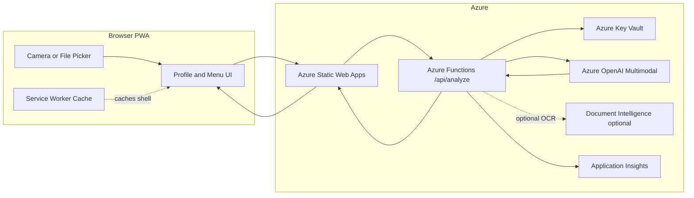
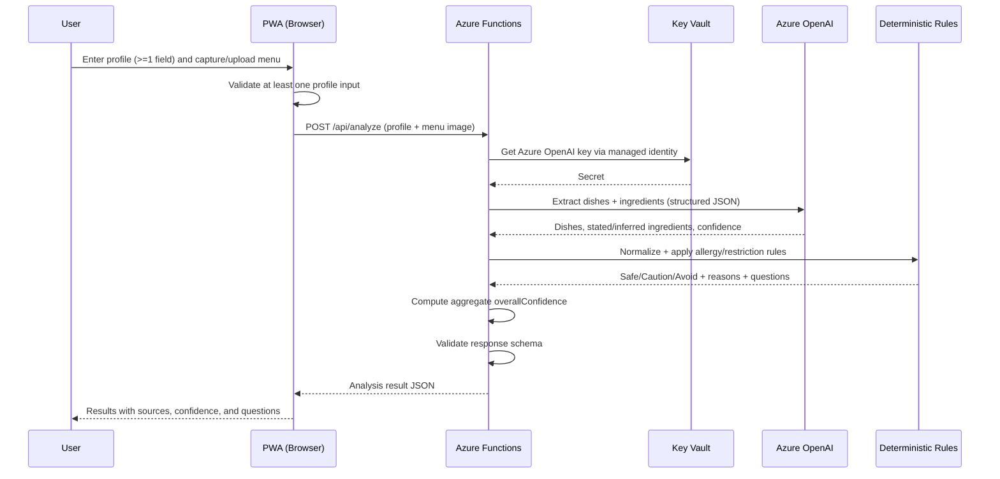

# Food Signal MVP Technical Details

## 1. Purpose

This document provides the technical implementation details for the Food Signal MVP. It complements:

- `Food-Signal-MVP-Requirements-and-PWA-Design.md`
- `Food-Signal-Architecture.md`
- `Food-Signal-PRD.md`

It covers the Azure resources needed for the MVP, a data flow diagram, and the recommended technology stack.

## 2. Solution Overview

Food Signal is a Progressive Web App with a small server-side API. The browser collects the user profile and menu image, the API orchestrates an Azure OpenAI multimodal model for extraction, and deterministic application code performs the final Safe, Caution, and Avoid classification. No sensitive profile data is persisted in the MVP.

## 3. Azure Resources for the MVP

The list below is the minimum viable set, followed by optional resources that improve the demo if time allows.

### 3.1 Required Resources

| # | Azure resource | Purpose in Food Signal | Notes for MVP |
| --- | --- | --- | --- |
| 1 | Azure OpenAI Service | Multimodal menu reading, dish and ingredient extraction, question generation | Deploy a vision-capable model such as GPT-4.1 or GPT-4.1-mini in a supported region |
| 2 | Azure Static Web Apps | Hosts the PWA frontend and provides integrated API | Free/standard tier; supports custom domains and HTTPS by default |
| 3 | Azure Functions | Server-side `/api/analyze` endpoint and trusted boundary for the model key | Can be the managed API of Static Web Apps, so no separate hosting is needed |
| 4 | Azure Key Vault | Stores the Azure OpenAI key and endpoint securely | Functions reads secrets via managed identity |
| 5 | Managed Identity | Lets Functions access Key Vault and Azure OpenAI without embedded secrets | System-assigned identity is sufficient |

### 3.2 Recommended for Reliability and Demo Quality

| # | Azure resource | Purpose | Notes |
| --- | --- | --- | --- |
| 6 | Application Insights | Telemetry for request timing, failures, and demo debugging | Avoid logging raw profile values |
| 7 | Azure AI Document Intelligence | Higher-accuracy OCR for difficult menu images or PDFs | Optional; the multimodal model may cover MVP OCR needs |
| 8 | Azure Blob Storage | Temporary storage for uploaded menu images if not processed in-memory | Use short-lived storage with a lifecycle rule; prefer in-memory for MVP |

### 3.3 Optional / Post-Hackathon

| # | Azure resource | Purpose | Notes |
| --- | --- | --- | --- |
| 9 | Azure Cosmos DB | Durable storage for saved profiles or ingredient knowledge base | Only after consent and privacy decisions |
| 10 | Azure API Management | Rate limiting, keys, and gateway policies | For a broader rollout, not the hackathon MVP |
| 11 | Azure Front Door / CDN | Global performance and caching of the PWA shell | Post-hackathon scaling |
| 12 | Azure AI Search | Retrieval-augmented ingredient/dish knowledge for regional cuisines | Powers the post-hackathon knowledge layer |

### 3.4 Minimal Deployable Footprint

For the fastest hackathon setup, the smallest working footprint is:

- Azure Static Web Apps (frontend + managed Functions API)
- Azure OpenAI Service (vision-capable deployment)
- Azure Key Vault (model secret)
- Application Insights (diagnostics)

This keeps the resource count low while preserving the security boundary and observability.

## 4. Data Flow Diagram

### 4.1 High-Level Component Flow

### 4.2 Request Sequence

### 4.3 Data Handling Notes

- The menu image is processed in-memory within the Function where possible and not persisted.
- Profile data stays in the browser session and is sent only for the duration of the analysis call.
- Secrets never reach the browser; the Function is the trusted boundary.
- Only non-sensitive telemetry (timings, counts, failures) goes to Application Insights.
- The analysis response includes per-dish `confidence` and a single aggregate `overallConfidence` object (`level` plus `reason`), matching the API contract in Section 9 of the MVP requirements document. The aggregate is advisory and never upgrades a dish to `Safe`.

## 5. Technology Stack

### 5.1 Frontend

| Layer | Recommended choice | Rationale |
| --- | --- | --- |
| Framework | React with Vite, or Next.js | Fast PWA development, strong ecosystem |
| Language | TypeScript | Type-safe request/response contracts |
| PWA | Web App Manifest + Service Worker (Workbox) | Installable, cached shell, mobile camera |
| Styling | Tailwind CSS or CSS Modules | Rapid responsive UI |
| State | React state + `sessionStorage` | Session-scoped profile, no backend store needed |
| Camera/upload | HTML file input with `capture` attribute | Native mobile camera capture without extra libraries |

### 5.2 Backend

| Layer | Recommended choice | Rationale |
| --- | --- | --- |
| API runtime | Azure Functions (Node.js/TypeScript or Python) | Serverless, integrates with Static Web Apps |
| AI access | Azure OpenAI SDK | Managed, secure model access |
| Secrets | Azure Key Vault + Managed Identity | No secrets in code or bundle |
| Validation | JSON Schema (e.g., Zod or Pydantic) | Enforce the model output contract |
| Rules engine | Plain TypeScript/Python + JSON config | Deterministic, testable classification |

### 5.3 AI and Data

| Concern | Choice | Rationale |
| --- | --- | --- |
| Primary model | Azure OpenAI GPT-4.1 (vision) | Menu image understanding + structured output |
| Cost/latency model | Azure OpenAI GPT-4.1-mini | Cheaper, faster extraction when adequate |
| OCR fallback | Azure AI Document Intelligence (optional) | Difficult images or PDFs |
| Ingredient knowledge | Versioned JSON dictionary | Reviewable alias/normalization map |
| Post-hackathon retrieval | Azure AI Search | Regional dish/ingredient knowledge base |

### 5.4 DevOps and Tooling

| Concern | Choice | Rationale |
| --- | --- | --- |
| Source control | GitHub | Standard, integrates with Static Web Apps CI/CD |
| CI/CD | GitHub Actions | Auto-deploy PWA and Functions |
| Infrastructure as Code | Bicep | Reproducible Azure provisioning |
| Monitoring | Application Insights | Latency, errors, demo diagnostics |
| Local dev | Static Web Apps CLI + Azure Functions Core Tools | Run frontend and API together locally |

### 5.5 Why This Stack Fits the 3-Day MVP

- Static Web Apps plus managed Functions gives one deploy target for the PWA and API.
- TypeScript end to end keeps the request/response contract consistent.
- Azure OpenAI provides vision and structured output in a single service.
- Deterministic rules live in plain code and JSON, so they are testable without the model and safe for allergy decisions.
- Key Vault and managed identity keep credentials out of the browser and the codebase.

## 6. Environment and Configuration

| Setting | Location | Example |
| --- | --- | --- |
| `AZURE_OPENAI_ENDPOINT` | Key Vault / Function app settings | `https://<resource>.openai.azure.com/` |
| `AZURE_OPENAI_DEPLOYMENT` | Function app settings | `gpt-4.1` deployment name |
| `AZURE_OPENAI_API_KEY` | Key Vault (referenced by Function) | Secret reference, never in the bundle |
| Dropdown options | Frontend config file | Diet restriction and diet lists |
| Ingredient alias map | Backend config file | Normalization dictionary JSON |
| Rule set | Backend config file | Allergy/restriction rules JSON |

## 7. Open Technical Decisions

- Functions language: Node.js/TypeScript or Python.
- Whether OCR is handled by the multimodal model or Document Intelligence.
- Whether menu images are ever written to Blob Storage or kept in-memory only.
- Azure OpenAI region and model deployment based on tenant availability.
- Frontend framework: React/Vite versus Next.js.
- Whether Application Insights is included in the 3-day scope or added just before the demo.
